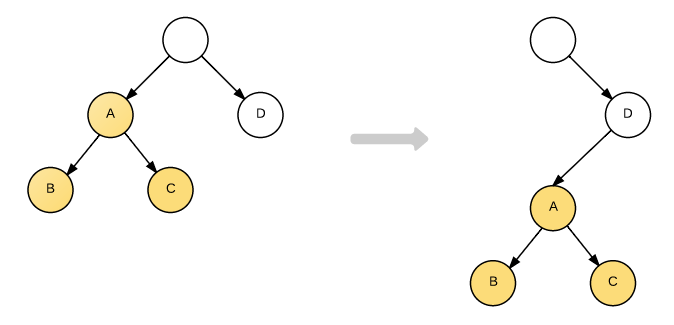

####引言
我们知道，DOM 操作真正的问题在于每次操作都会触发布局的改变、DOM树的修改和渲染。所以，当你一个接一个地去修改30个节点的时候，就会引起N次（潜在的）布局重算，N次（潜在的）重绘，等等。


#### 二、什么是虚拟DOM？
虚拟DOM是在DOM的基础上建立了一个抽象层，对数据和状态所做的任何改动，都会被自动且高效的同步到虚拟DOM，最后再批量同步到DOM中。

Virtual DOM 实际上没有使用什么全新的技术，仅仅是把 “ 双缓冲（double buffering）” 技术应用到了DOM上面。
这样一来，当你在这个单独的虚拟的DOM树上也一个接一个地修改30个节点的时候，它不会每次都去触发重绘，所以修改节点的开销就变小了。
之后，一旦你要把这些改动传递给真实DOM，之前所有的改动就会整合成一次DOM操作。这一次DOM操作引起的布局计算和重绘可能会更大，但是相比而言，整合起来的改动只做一次，减少了（多次）计算。


虚拟DOM是React等的一大亮点，具有batching(批处理)和高效的Diff算法。这让我们可以无需担心性能问题而”毫无顾忌”的随时“刷新”整个页面，由虚拟DOM来确保只对界面上真正变化的部分进行实际的DOM操作。


<br/>
<br/>


<br/>

innerHTML：render html字符串 + 重新创建所有 DOM 元素

虚拟DOM：render 虚拟DOM + diff + 更新必要的 DOM 元素

<br/>

#### 虚拟DOM的优点：
最终表现在DOM上的修改只是变更的部分，可以保证非常高效的渲染。


####虚拟DOM的缺点：
首次渲染大量DOM时，由于多了一层虚拟DOM的计算，会比innerHTML插入慢。


#### 原理:
React会在内存中维护一个虚拟DOM树，对这个树进行读或写，实际上是对虚拟DOM进行。当数据变化时，会自动更新虚拟DOM，然后将新的虚拟DOM和旧的虚拟DOM进行对比，找到变更的部分，得出一个diff，然后将diff放到一个队列里，最终批量更新这些diff到DOM中。

###### 步骤一：用JS对象模拟DOM树 <br/>
###### 步骤二：比较两棵虚拟DOM树的差异<br/>
###### 步骤三：把差异应用到真正的DOM树上 <br/>


```
//模拟dom
function Element(tagName, props, children) {
  this.tagName = tagName
  this.props = props
  this.children = children
}

module.exports = function (tagName, props, children) {
  return new Element(tagName, props, children)
}

//渲染
Element.prototype.render = function () {
  var el = document.createElement(this.tagName) // 根据tagName构建
  var props = this.props

  for (var propName in props) { // 设置节点的DOM属性
    var propValue = props[propName]
    el.setAttribute(propName, propValue)
  }

  var children = this.children || []

  children.forEach(function (child) {
    var childEl = (child instanceof Element)
      ? child.render() // 如果子节点也是虚拟DOM，递归构建DOM节点
      : document.createTextNode(child) // 如果字符串，只构建文本节点
    el.appendChild(childEl)
  })

  return el
}
```


<p style="color:blue;">例如上面的 DOM 结构就可以简单的表示：</p>
```
var el = require('./element');
var ul = el('ul', {id: 'list'}, [
  el('li', {class: 'item'}, ['Item 1']),
  el('li', {class: 'item'}, ['Item 2']),
  el('li', {class: 'item'}, ['Item 3'])
])
```

注：在前端当中，你很少会跨越层级地移动DOM元素。所以 Virtual DOM 只会对同一个层级的元素进行对比，上面的div只会和同一层级的div对比，第二层级的只会跟第二层级对比。这样算法复杂度就可以达到 O(n)。


#### (1)深度优先遍历，记录差异


在深度优先遍历的时候，每遍历到一个节点就把该节点和新的的树进行对比。如果有差异的话就记录到一个对象里面。

```


// diff 函数，对比两棵树
function diff (oldTree, newTree) {
  var index = 0 // 当前节点的标志
  var patches = {} // 用来记录每个节点差异的对象
  dfsWalk(oldTree, newTree, index, patches)
  return patches
}

// 对两棵树进行深度优先遍历
function dfsWalk (oldNode, newNode, index, patches) {
  // 对比oldNode和newNode的不同，记录下来
  patches[index] = [...]

  diffChildren(oldNode.children, newNode.children, index, patches)
}

// 遍历子节点
function diffChildren (oldChildren, newChildren, index, patches) {
  var leftNode = null
  var currentNodeIndex = index
  oldChildren.forEach(function (child, i) {
    var newChild = newChildren[i]
    currentNodeIndex = (leftNode && leftNode.count) // 计算节点的标识
      ? currentNodeIndex + leftNode.count + 1
      : currentNodeIndex + 1
    dfsWalk(child, newChild, currentNodeIndex, patches) // 深度遍历子节点
    leftNode = child
  })
}
```


#####(2)差异类型
```
//替换
var REPLACE = 0;
//排序
var REORDER = 1;
//属性变化
var PROPS = 2;
//文本
var TEXT = 3;
```

#####(3)列表对比算法

疑问：什么是DOM Diff算法 ？
Web界面由DOM树来构成，当其中某一部分发生变化时，其实就是对应的某个DOM节点发生了变化。在React中，构建UI界面的思路是由当前状态决定界面。前后两个状态就对应两套界面，然后由React来比较两个界面的区别，这就需要对DOM树进行Diff算法分析。

即给定任意两棵树，找到最少的转换步骤。但是标准的的Diff算法复杂度需要O(n^3)，这显然无法满足性能要求。要达到每次界面都可以整体刷新界面的目的，势必需要对算法进行优化。这看上去非常有难度，然而Facebook工程师却做到了，他们结合Web界面的特点做出了两个简单的假设，使得Diff算法复杂度直接降低到O(n)

1、两个相同组件产生类似的DOM结构，不同的组件产生不同的DOM结构；
2、对于同一层次的一组子节点，它们可以通过唯一的id进行区分。


<h4>逐层进行节点比较</h4>
在React中，树的算法其实非常简单，那就是两棵树只会对同一层次的节点进行比较.


React只会对相同颜色方框内的DOM节点进行比较，即同一个父节点下的所有子节点。当发现节点已经不存在，则该节点及其子节点会被完全删除掉，不会用于进一步的比较。这样只需要对树进行一次遍历，便能完成整个DOM树的比较。

<h3>例如：</h3>



A节点被整个移动到D节点下，直观的考虑DOM Diff操作应该是

```
A.parent.remove(A); 
D.append(A);
```

但因为React只会简单的考虑同层节点的位置变换，对于不同层的节点，只有简单的创建和删除。当根节点发现子节点中A不见了，就会直接销毁A；而当D发现自己多了一个子节点A，则会创建一个新的A作为子节点。因此对于这种结构的转变的实际操作是：

```
A.destroy();
A = new A();
A.append(new B());
A.append(new C());
D.append(A);
```


<h3>list-diff2算法 简介</h3>

```
oldList = [{id: 1}, {id: 2}, {id: 3}, {id: 4}, {id: 5}, {id: 6}];
newList = [{id: 2}, {id: 3}, {id: 1},];

var moves = diff(oldList, newList, "id");

// children 是源列表 根据 新列表返回 移动或新增的数据。
// children = [
//     {id: 1},
//     {id: 2},
//     {id: 3},
//     null,
//     null,
//     null
// ]
// moves 是源列表oldList 根据新列表newList 返回的操作，children为null的话，依次删除掉掉，因此返回的是
// type = 0 是删除操作， type = 1 是新增操作
// moves = [
//     {type: 0, index:3},
//     {type: 0, index: 3},
//     {type: 0, index: 3},
//     {type: 0, index: 0},
//     {type: 1, index: 2, item: {id: 1}}
// ]
``` 
[npm 库](https://www.npmjs.com/package/list-diff2)


#####（4）把差异应用到真正的DOM树上
见代码

<br/>
<br/>
<br/>


#### 对虚拟DOM的误解 
React等从来没有说过 “React 比原生操作DOM快”。React给我们的保证是，在不需要手动优化的情况下，它依然可以给我们提供过得去的性能。

React掩盖了底层的DOM操作，可以用更声明式的方式来描述我们目的，从而让代码更容易维护。

没有任何框架可以比纯手动的优化 DOM 操作更快，因为框架的 DOM 操作层需要应对任何上层 API 可能产生的操作，它的实现必须是普适的。针对任何一个 benchmark，我都可以写出比任何框架更快的手动优化，但是那有什么意义呢？在构建一个实际应用的时候，你难道为每一个地方都去做手动优化吗？出于可维护性的考虑，这显然不可能。


####还有
虚拟dom并没有比直接原生操作更快, 所谓"快"是有条件的
比如改变个颜色, 直接操作dom会更快.如果每次都是改变该改变的。那dom操作永远比虚拟dom快.但如果你的改动的地方很多, 而且要保持状态, 那虚拟dom的自动diff无疑会省心.
如果有很多复杂的操作，A+B+C, 这时候你要直接操作dom会很繁琐.
而且虚拟dom的核心在于diff, 它自动帮你计算那些应该调整, 然后只修改该修改的区域, 省下的不是运行速度这种速度, 而且我们开发方面的一些速度。以及运维的速度。其次，如果任何一点的变化都需要重新渲染整个应用，如果是真实DOM的话，这样的性能是不能接受的
